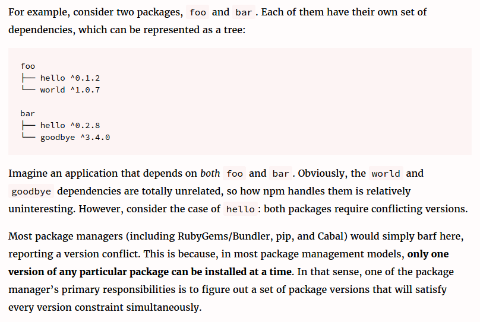

# Packaging / npm

## Dependancies

### What is a dependancy?

A dependancy is a node module required for your code to work properly. Node's power comes from its use of lots of different modules, because these modules can be (and often are) interdependant, it is important to specify those that your code is dependant on. The modules that your code is **dependant** on are referred to as **dependancies**.<br>
you define these dependancies in your package.json. You define both the name of the module and the version your code is dependant on.<br>

e.g. the "request" module is an npm module made to simplify http requests. If you use this module in your code you'll have to add it as a dependancy in your package.json. <br>
When in the root directory of your project if you run ```npm install -S <package-name>``` in your terminal you will install the package to your node_modules directory and also add it to the dependancies in your package.json. <br>
This means if someone pulls your project from github they just have to run "npm install" when in the root directory of the project and it will install all of the dependancies. (since you never push your node modules to github because you are a good developer :wink:)
<br><br>

### Why might you use a dependancy rather than writing the code from scratch?

You may have found, for example when writing a generic fetch function (to make a call to an api and return the xhr.responsetext as a json object) during the api week project, that there is a tried and tested way of writing certain bits of code. Pretty much everyone's fetch function looked the same.<br><br>
This is why we use dependancies rather than write code from scratch.<br><br>
There are certain problems in programming that have standard ways of being fixed, dependacies allow you to use tried and tested ways of solving these problems (which is why it's important to use reliable modules as dependancies) while focussing on solving the problems specific to your project.

### What have been some of the traditional problems with dependancies?

#### :hocho: Dependancy hell :hocho:
Dependancy hell refers to the problem in software where different dependacies for an app have their own sub-dependancies which conflict. To simplify [(stolen from here)](https://lexi-lambda.github.io/blog/2016/08/24/understanding-the-npm-dependency-model/):

<br>
In short a traditional dependancy model will only allow one version of each dependancy, meaning if different modules depend on the same module but different versions, you'll have problems. <br>
Becuase in the node/npm dependancy model each individual module has its own node-modules file and package.json to define its dependancies you never get conflicts from different modules depending on different versions of the same module.
